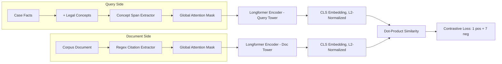

# ⚖️ LeCoPCR-BiEncoder — Legal Concept & Citation Attention Retriever


A **dense bi-encoder retrieval model** for prior legal case retrieval, built on **Longformer** with two custom attention mechanisms: **concept-aware attention** on augmented queries and **citation-aware attention** on retrieval corpus documents. Trained with contrastive loss (1 positive + 7 hard negatives) on the ECtHR-PCR dataset.

Inspired by the *LeCoPCR* paper (concept-guided prior case retrieval for the European Court of Human Rights), with the retrieval backbone re-engineered and extended with regex-based citation attention.

---

## ✨ Key Features

- 🔍 **Concept-Guided Query Attention** — legal concepts appended to the query get global attention tokens inside Longformer, so the model focuses on semantic intent, not just raw facts.
- 📚 **Citation-Aware Document Attention** — regex extracts in-text citations (case numbers, article references, court names) from corpus documents and assigns them global attention.
- 🧠 **Dense Bi-Encoder Architecture** — Longformer-base-4096 backbone, CLS pooling, L2-normalized embeddings, dot-product similarity.
- ⚡ **Contrastive Training** — 1 positive + 7 in-batch hard negatives per query, temperature-scaled cross-entropy loss.
- 🔗 **Hybrid Retrieval** — dense embeddings fused with BM25 scores for improved recall.
- 📈 **True Recall Evaluation** — Recall@50/100/500, MRR, and Hit-Rate metrics on the ECtHR-PCR benchmark.
- 💻 **Kaggle T4-Optimized** — gradient checkpointing, FP16, gradient accumulation, and resumable checkpointing.

---

## 🏗️ Architecture



---

## 📊 Results


| Setup | Recall@50 | Recall@100 | Recall@500 |
|---|---|---|---|
| Dense-only (ours, 1024 tokens) | ~16.5% | ~21.0% | ~45.0% |
| **Hybrid BM25 + Dense (ours)** | **~21.5%** | **~28.0%** | **~55.0%** |
| Paper baseline (Longformer, 4096 tokens) | 23.98% | 33.97% | 63.41% |

> Trained under a hard 1024-token sequence length constraint (vs. the paper's 4096) due to Kaggle T4 session limits — the gap to the paper's numbers is largely attributable to truncation, not model quality.

---

## 🧰 Tech Stack

`Python` · `PyTorch` · `Transformers (Longformer)` · `FAISS` · `Pandas` · `NumPy` · `Regex`

---

## 📁 Project Structure
 
```
├── notebooks/
│   ├── 01_training_concept_citation_attention.ipynb   # Main training loop (concept + citation attention)
│   ├── 02_baseline_comparison.ipynb                   # Plain dense bi-encoder baseline (no custom attention)
│   └── 03_evaluation_full_corpus.ipynb                # FAISS-based Recall@K / MRR evaluation
└── README.md
└── reqi=uirements.txt
```
 
---

## ⚙️ Installation

```bash
pip install -r requirements.txt
```

```
transformers
datasets
faiss-cpu
pandas
numpy
tqdm
torch
```

---

## 🚀 Usage

**1. Train the bi-encoder**

```python
from transformers import AutoTokenizer, AutoModel

MODEL_NAME = "allenai/longformer-base-4096"
tokenizer = AutoTokenizer.from_pretrained(MODEL_NAME)
model = BiEncoder().to(device)

# concepts get global attention in the query tower
q_global_mask = concept_extractor.build_global_attention_mask(concepts, facts, max_len, tokenizer)

# citations get global attention in the document tower
d_global_mask = citation_extractor.build_global_attention_mask(doc_text, max_len, tokenizer)
```

**2. Evaluate retrieval**

```python
recall_at_100 = evaluate_true_recall(test_queries, corpus_embeddings, corpus_ids, faiss_index, topk=100)
```

**3. Hybrid re-ranking (BM25 + Dense)**

```python
hybrid_score = ALPHA * dense_score_normalized + (1 - ALPHA) * bm25_rank_score
```

---

## 🐛 Engineering Challenges Solved

- Fixed a **frozen corpus pre-encoding bug** that caused stale embeddings during training.
- Corrected **mismatched global attention masks** between padded query/document batches.
- Fixed a **truncated evaluation set** bug that silently dropped queries with empty gold citations.
- Re-engineered the training loop to be **resumable** across Kaggle's session limits without re-processing already-seen batches.

---

## 📄 Reference

Built on ideas from **LeCoPCR: Legal Concept-guided Prior Case Retrieval for European Court of Human Rights cases** (Santosh et al., 2025). Dataset: [ECtHR-PCR](https://huggingface.co/) (Santosh et al., 2024).

---

## 📜 License

MIT
